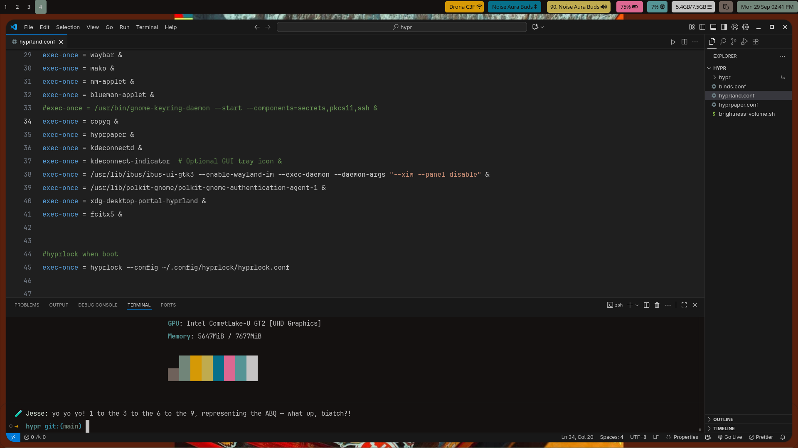

# VSCode Settings

These are my personal **Visual Studio Code settings** to make your editor clean, fast, and visually appealing.  
This `settings.json` focuses on:

- Minimal distractions  
- Smooth coding experience  
- Improved typography and readability  
- Efficient workspace navigation  

> Works on Linux, macOS, and Windows (just copy the file to your VSCode User settings folder).

---

## Screenshot

Here’s how my VSCode looks with these settings:  



---

## Features

### 🎨 UI / Editor
- No unnecessary UI clutter: breadcrumbs, tips, lightbulbs, minimap, and overview ruler removed  
- Sidebar moved to the **right** for better workflow  
- Smooth cursor blinking (`solid`), no sticky scroll  
- Line numbers always on  
- Better control over whitespace: auto-trim trailing spaces and add final newline  

### ✍️ Typography
- Fonts: **Geist Mono**, **JetBrains Mono**, **Fira Code**  
- Font size: `16` with line height `32` for comfortable reading  
- Terminal font size: `16` with `1.5` line height  
- Advanced font ligatures enabled (`ss01-ss08`, `calt`, `dlig`)  

### ⚡ Coding Enhancements
- Format on Save enabled for: **JavaScript, TypeScript React, Vue, Tailwind, HTML, CSS**  
- Snippet suggestions appear at the **top**  
- Includes `-` in word selection (useful for CSS and kebab-case vars)  
- Multiple “Go to Definition/References” options simplified to **goto** only  
- Linked editing enabled for paired tags  

### 🔍 Search / File Management
- Excludes noisy folders/files: `node_modules`, `vendor`, `dist`, `storage`, lock files, PHPUnit cache, etc.  
- Explorer sorting by **type**  
- Auto-save enabled (after delay)  

### 🌀 Git / SCM
- Git decorations disabled (no noisy gutter icons)  
- SCM diff decorations hidden  
- Prevents opening repos in parent folders by default  

### 💻 Terminal
- Multiple profiles supported: **bash, zsh, fish, tmux, pwsh, sh**  
- Default: **zsh**  
- Multi-line paste warning disabled  

---

## Installation

1. Backup your current `settings.json` (optional).  
2. Copy this file to your VSCode User settings folder:

**Linux:**  
```bash
~/.config/Code/User/settings.json
